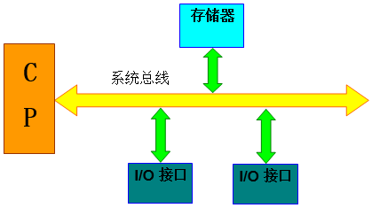
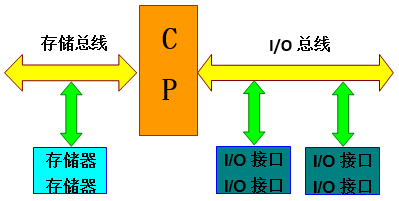
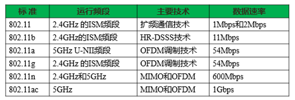
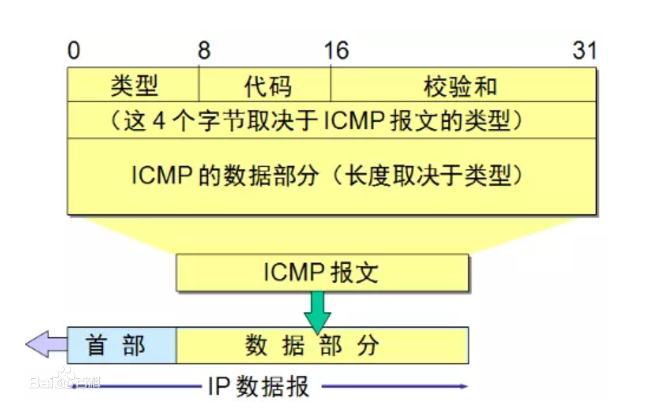

`网络工程师考点积累`

# 前言

- 本项目供准备考软考网络工程师的同学浏览。

- 文章很多地方不是很完善，希望能和同学们共同完善这个项目。

- 如需提交内容，请**Issue**。

# 1.计算机硬件

## 1.1 计算机基本组成

主要分为六部分：`控制器`，`运算器`，`内存储器`，`外存储器`，`输入设备`，`输出设备`

控制器

### 运算器

功能：在运算器的控制下完成各种算术运算，逻辑运算和其他运算。

运算器包括：`算术逻辑单元（ALU）`，`加法器/累加器`，`数据缓冲寄存器`，`程序状态寄存器`四个子部件构成。

1. `算术逻辑单元（ALU）`:

	> 主要完成对二进制数据的`算术运算（加减乘除），逻辑运算（与或非异或），以及移位操作`

2. `加法器/累加器`:

	>是一个通用寄存器，为ALU提供一个工作区，用于`传输和暂用户数据`

3. `数据缓冲寄存器`:

	> 用来存放由内存储器读出的一条指令和一个数据字

4. `程序状态寄存器`:

	> 状态寄存器用于记录运算中产生的标志信息

### 控制器

控制器有`程序计数器`，`指令寄存器`，`指令译码器`，`时序产生器`和`操作控制器`组成，完成整个计算机系统的操作

1. `指令译码器`

	> 将指令中的操作数解码，告诉CPU该做什么，可以说指令寄存器的输出就是指令译码器的输入

2. `指令寄存器`

	>存储当前正在被CPU执行的指令
	
3. `程序计数器`

   >是专用寄存器，具有存储和计数两种功能，储存进入CPU前的一条指令

4. `时序产生器`

   >产生各种时序信号

## 1.2 常考的寄存器

1. **程序计数器**	（控制器）	

   >  程序计数器（PC)用于存放指令的地址。**当程序顺序执行时，每取出一条指令，PC内容自动增加一个值，指向下一条要取的指令**。当程序出现转移时，则将转移地址送入PC,然后由PC指出新的指令地址。	

2. **状态寄存器**	

   > 状态寄存器用于记录运算中产生的标志信息。状态寄存器中的每一位单独使用，称为标志位。标志位的取值反映了ALU当前的工作状态，可以作为条件转移指令的转移 条件。典型的标志位有以下几种：进位标志位（C)、零标志位（Z)、符号标志位（S)、 溢出标志位（V)、奇偶标志位（P)»

3. **通用寄存器**	

   > 通用寄存器组是CPU中的一组工作寄存器，运算时用于**暂存操作数或地址**。在程序中使用通用寄存器可以减少访问内存的次数，提高运算速度。

4. **累加寄存器**

   > 数据寄存器，在运算过程中**暂存操作数和中间运算结果**，不能用于长时间地保存一个数据。

#### 髙速缓存

提供“髙速缓存”的目的是为了让数据存取的速度适应CPU的处理速度，其基于的原理是内存中“程序执行与数据访问的局域性行为”，即一定程序执行时间和空间内，被访问的代码集中于一部分。为了充分发挥髙速缓存的作用，不仅依靠“暂存刚刚访问过的数据”，还要使用硬件实现的指令预测与数据预取技术，即尽可能把将要使用的数据预先从内存中取到高速缓存中。

一般而言，主存使用DRAM技术，而Cache使用昂贵但较快速的SRAM技术。

目前微计算机上使用的AMD或Intel微处理器都在芯片内部集成了大小不等的数据高速缓存和指令高速缓存，通称为L1高速缓存（L1 Cache,即第一级片上高速缓冲存储器)；而比U容量更大的L2髙速缓存曾经被放在CPU外部（主板或者CPU接口卡上)， 但是现在已经成为CPU内部的标准组件；更昂贵的顶级家用和工作站CPU甚至会配备比L2髙速缓存还要大的L3高速缓存。

## 数据运算

源码反码补码

> |      | 定点整数                      | 定点小数 |      |      |
> | ---- | ----------------------------- | -------- | ---- | ---- |
> | 原码 | \-\(2^\(n-1\)^\-1\)~2^(n-1)-1 |          |      |      |
> | 反码 | -(2^(n-1)-1)~2^(n-1)-1        |          |      |      |
> | 补码 | -(2^n)～2^(n-1)-1             |          |      |      |

## 总线

### 单总线结构

单总线结构如下图所示。计算机的各个部件均系统总线相连，所以它又称为面向系统的单总线结构。在单总线结构中，CPU与主存之间、CPU与I/O设备之间、I/O设备与主存之间、各种设备之间都通过系统总线交换信息。单总线结构的优点是控制简单方便，扩充方便。`但由于所有设备部件均挂在单一总线上，使这种结构只能分时工作，即同一时刻只能在两个设备之间传送数据，这就使系统总体数据传输的效率和速度受到限制`，这是单总线结构的主要缺点。

### 双总线结构

双总线结构又分为面向CPU的双总线结构和面向存储器的双总线结构。
面向CPU的双总线结构如下图所示。其中一组总线是CPU与主存储器之间进行信息交换的公共通路，称为存储总线。另一组是CPU与I/O设备之间进行信息交换的公共通路，称为输入/输出总线（I/O总线）。外部设备通过连接在I/O总线上的接口电路与CPU交换信息。
由于在CPU与主存储器之间、CPU与I/O设备之间分别设置了总线，从而提高了微机系统信息传送的速率和效率。但是由于外部设备与主存储器之间没有直接的通路，它们之间的信息交换必须通过CPU才能进行中转，从而降低了CPU的工作效率（或增加了CPU的占用率。一般来说，外设工作时要求CPU干预越少越好。CPU干预越少，这个设备的CPU占用率就越低，说明设备的智能化程度越高），这是面向CPU的双总线结构的主要缺点 。

## 控制器

控制器的作用是控制整个计算机的各个部件有条不紊地工作，它的基本功能就是从内存取指令和执行指令。

## 主存储器

主存储器主要由存储体、控制线路、地址寄存器、数据寄存器和地址译码电路等部分组成。

### 相联存储器

相联存储器是一种按内容访问的存储器。其工作原理就是把数据或数据的某一部分作为关键字，将该关键字与存储器中的每一单元进行比较，找出存储器中所有与关键字相同的数据字。

相联存储器可用在高速缓冲存储器中，在虚拟存储器中用来作段表、页表或快表存储器，还常用在数据库和知识库中。

## 指令系统基础知识

指令中的寻址方式就是如何对指令中的地址字段进行解释，以获得操作数的方法或获得程序转移地址的方法。

**常用的寻址方式有:**

•立即寻址。操作数就包含在指令中。

•直接寻址。操作数存放在内存单元中，指令中直接给出操作数所在存储单元的地址。

•寄存器寻址。操作数存放在某一寄存器中，指令中给出存放操作数的寄存器名。 

•寄存器间接寻址。操作数存放在内存单元中，操作数所在存储单元的地址在某个寄存器中。

•间接寻址。指令中给出操作数地址的地址。

•相对寻址。指令地址码给出的是一个偏移量（可正可负），操作数地址等于本条指令的地址加上该偏移量。

•变址寻址。操作数地址等于变址寄存器的内容加偏移量。

## Gantt图和PERT图

软件项目计划的一个重要内容是安排进度，常用的方法有Gantt图和PERT图。

一、Gantt图(甘特图)

**Gantt图用水平条状图描述，它以日历为基准描述项目任务，可以清楚地表示任务的持续时间和任务之间的并行，`但是不能清晰地描述各个任务之间的依赖关系`**

甘特图以图示通过活动列表和时间刻度表示出特定项目的顺序与持续时间。一条线条图，`横轴`表示时间，`纵轴`表示项目，线条表示期间计划和实际完成情况。直观表明计划何时进行，进展与要求的对比。便于管理者弄清项目的剩余任务，评估工作进度。

甘特图是以作业排序为目的，将活动与时间联系起来的最早尝试的工具之一，帮助企业描述`工作中心`、`超时工作`等资源的使用。

甘特图包含以下三个含义：

1、以图形或表格的形式显示活动；

2、通用的显示进度的方法；

3、构造时含日历天和持续时间，不将周末节假算在进度内。

简单、醒目、便于编制，在管理中广泛应用。

甘特图按内容不同，分为计划图表、`负荷图`表、机器闲置图表、人员闲置图表和进度表五种形式。

二、PERT图

**PERT图是一种网络模型，描述一个项目任务之间的关系。可以明确表达任务之间的依赖关系，即哪些任务完成后才能开始另一些任务，以及如期完成整个工程的关键路径**，`但是不能清晰地描述各个任务之间的并行关系。`

PERT图是一个`有向图`，图中的有向弧表示任务，它可以标上完成该任务所需的时间；图中的`结点`表示流入结点的任务的结束，并开始流出结点的任务，这里把结点称为事件。只有当流入该结点的所有任务都结束时，结点所表示的事件才出现，流出结点的任务才可以开始。事件本身不消耗时间和资源，它仅表示某个时间点。每个事件有一个事件号和出现该事件的最早时刻和最迟时刻。每个任务还有一个松弛时间，表示在不影响整个工期的前提下，完成该任务有多少机动余地。松弛时间为0的任务构成了完成整个工程的关键路径。

例题：如下图中任务流：

ABEGHIK的持续时间是36；ABEGHJK的持续时间是40；

ACEGHIK的持续时间是33；ACEGHJK的持续时间为37。

所以项目关键路径长度为40。

## 基本文件格式

### 影片格式

- `MOV`即QuickTime影片格式，它是Apple公司开发的一种音频、视频文件格式，用于存储常用数字媒体类型，如音频和视频。

### 音频文件

- `WAV`

- `MP3`

### 图片文件

- `BMP`是图片文件。

## DPI

DPI是指每英寸的像素,对于150DPI来说，每英寸就是150\*150个点，现在3×4英寸，点的个数就是150\*3\*150\*4。使用150DPI的扫描分辨率扫描一幅3×4英寸的彩色照片，得到原始的24位真彩色图像的数据量是

(150\*3\)\*\(150\*4\)\*24/8=810000Byte。

例如要冲洗3*4英寸的照片，扫描精度是300dpi，那么文件尺寸应该是(3*300)*(4*300)=900像素*1200像素。

## 分页管理 

某计算机系统页面大小为 4K ，进程的页面变换表如下所示。若进程的逻辑地址 为 2D16H 。该地址经过变换后，其物理地址应为（8）。

页面大小是4K（`2的12次方`），逻辑地址是2D16H，转为二进制是0010 1101 0001 0110，那么后12位是业内地址，前0010是页号，通过查表物理块号是4，所以物理地址是4D16H。

## 特别注意的一些法规

目前根据我国法律法规的规定必须使用注册商标的是烟草类商品。

# 2.数据通信基础

## 2.1 信道特性

### 1. 尼奎斯特定理

**信道带宽为W,波特率B有:**
$$
B=2W
$$
**一个码元携带的信息量n与吗元的种类数N有如下关系**:
$$
n=log_2(N)
$$
#### 调制技术与码元种类

| 调制技术 | 名称                | 码元种类 | 比特位 |
| -------- | ------------------- | -------- | ------ |
| ASF      | 幅度键控            | 2        | 1      |
| FSK      | 频移键控            | 2        | 1      |
| PSK      | 相位键控（2相调制） | 2        | 1      |
| DPSK     | 4相键控调制         | 4        | 2      |
| QPSK     | 正交相移键控        | 4        | 2      |

单位时间内在信道上传送的位数称为数据数率,在一定的波特率下提高速率的途径是用一个码元表示更多的位数

$$
R=Blog_2N=2Wlog_2N(bps)
$$

###  2. 香农定理

$$
C=Wlog_2(1+\frac{S}{N})
$$

### 3. 信噪比

$$
dB=10log_{10}\frac{S}{N}
$$

## 2.2 数字调制技术

### 正交幅度调制

### BPSK

### QPSK（正交相移键控）

QPSK是一种四进制相位调制,2位二进制表示一种码元，码元速率为二进制数据速率的一半。

### MPSK

### DPSK调制(差分相移键控)

默认n为2

载波的相对初始相位变化来实现数据的传送，并且初始相位与前一码元的发生180度变化为二进制0，无变化为1

### 4B/5B编码

为了提髙编码的效率，降低电路成本，可以采用4B/5B编码

这实际上是一种两级编码方案。在传输介质上传送的是“见1就翻不归零码” (NRZ-I),这种编码的效率是100%，即一个脉冲代表一位。NRZ-I代码序列中“1”的个数越多，越能提供同步定时信息，但如果遇到长串的“0”，则不能提供同步信息，所以在此之前还需经过一次4B/5B编码转换。发送器扫描要发送的位序列，4位分为一组，然后按照下表的对应规则变换成5位的代码。

## 2.3 脉冲编码调制 PCM
### 数据编码
## 2.4 通信方式和交换方式
### 时分多路复用
## 2.5 多路复用

| 名称                  | 原理与组成                                                   | 应用地区               |
| --------------------- | ------------------------------------------------------------ | ---------------------- |
| T1载波（一次群，DS1） | 采用同步时分复用技术将24路话音通路(每个话音信道称为DS0)，复合在一条1.544Mbps的高速信道上 | 美国和日本             |
| E1载波                | 采用同步时分复用技术将30路话音信道(64Kbps)和两个控制信道(16Kbps)复合在一条2.048Mbps的高速信道上 | 欧美发起，除美国和日本 |
| T2载波(DS2)           | 4个T1时分复用而成，达到6.312Mbps                             | 美国和日本             |
| T3载波(DS3B)          | 7个T2时分复用而成，达到44.736Mbps                            | 美国和日本             |
| T4载波(DS4B)          | 6个T3时分复用而成，达到274.176Mbps                           | 美国和日本             |

### T1载波

T1载波的数据速率是1.544Mb/s

### E1载波

E1载波的数据速率是2.048Mb/s

## 2.6 差错控制
### 海明码

#### 海明距离

海明距离是把一个有效码字变成另一个有效码字所要改变的位数。如果对于m位的数据，增加k位冗余位,`一对有效码字之间的海明距离是两个码字之间不同的比特数`

## 计算距离公式

m为数据位,k为海明码位数,有公式:

$$
m+k<2^k-1
$$

### CRC校验码

| 网络协议          | CRC位       | 应用点                     |
| ----------------- | ----------- | -------------------------- |
| HDLC              | CRC16/CRC32 | 除帧标志外的全帧           |
| FR（帧中继）      | CRC16       | 除帧标志外的全帧           |
| ATM               | CRC8        | 帧头校验                   |
| 以太网（802.3）   | CRC32       | 帧头（不含前导和帧起始符） |
| 令牌总线（802.4） | CRC32       | 帧头（不含前导和帧起始符） |
| 令牌环（802.5）   | CRC32       | 帧头（从帧控制字段到LLC）  |
| EDDI              | CRC32       | 帧头（从帧控制字段到INFO） |

## 联网接口

- `RJ45端`在这种端口上通过**双绞线连接以太网**。10Base-T的RJ~45端口标识为“ETH”，而100Base-TX的RJ45端LJ标识为10/100bTX”，这是因为快速以太网路由器采用10/100Mb/s自适应电路。

- `AUI端口`:这是一种**D型15针连接器**，用**在令牌环网或总线型以太网中**。路由器经AUI端口通过粗同轴电缆收发器连接l0Base-5网络，也可以通过外接的AUI-to-RJ-45适配器连接10Base-T以太网，还可以借助其他类型的适配器实现与10Basc-2细同轴电缆或10Base-F光缆的连接。

- `高速同步串口` ：在路由器与广域网的连接中，应用最多的是高速同步串行口 (Synchronous Serial Port),这种端口`用于连接DDN、帧中继、X.25和PSTN等网络`。通过这种端口所连接的网络两端要求同步通信，以很高的速宰进行数据传输。

- `ISDN BR1端口`：这种端口通过ISDN线路实现路由器与Internet或其他网络的远程连接。ISDN BRI三个通道（2B+D)的总带宽为144 kb/s,端口采用RJ-45标准，与ISDN NT1的连接使用RJ-45-to-RJ~45直通线。

- `Console端口`：Console端口通过配置专用电缆连接至计算机串行口，利用**终端仿真程序（如Windows中的超级终端）对路由器进行本地配置**。路由器的Console端U为RJ-45U。Console端口不支持硬件流控。

- `AUX端口`：对路由器进行远程配置时要使用“AUX”端口（Auxiliary Prot)。AUX端口在外观上与RJ-45端口一样，只是内部电路不同，实现的功能也不一样。**通过AUX端口与Modem进行连接必须借助RJ-45 to DB9或RJ-45 to DB25适配器进行电路转换。AUX端口支持硬件流控**。

- `异步串口`：异步串口（ASYNC)主要应用于与Modem或Modem池的连接，以实现远程计算机通过PSTN拨号接入。异步端口的速率不是很高，也不要求同步传输，只要求能连续通信就可以了。

# 3.广域通信网
## 公共交换电话网
### 电路交换网
## X.25公共数据网

属于：`非广播多址网络`

### HDLC
### 流量控制
## 帧中继网

帧中继（Frame Relay, FR)网络运行在OSI参考模型的`物理层`和`数据链路层`。`FR用第二层的帧承载数据业务`，因而`第三层被省掉`了。帧中继提供面向连接的服务，在互相通信的每对设备之间都存在一条定义好的虚电路，并且指定了一个链路识别码DLCI。 帧中继利用了光纤通信和数字网络技术的优势，FR帧层操作比HDLC简单，只检査错误，不再重传，`没有滑动窗口式的流量控制机制`，`只有拥塞控制`。所以，帧中继比X.25具有更高的传输效率。

普通路由器就可以配置成帧中继交换机。在路由器串行接口配置FR封装的命令如下表所示，可设置的本地管理接口类型有3种`{ansi丨cisco | q933a}`

## ISDN

`ISDN（综合业务数据网）`，淘汰了的东西

使用`TDM`技术

ISDN 分为`窄带ISDN` (Narrowband ISDN, N-ISDN)和`宽带 ISDN` (Broadband ISDN, B-ISDN)。 N-ISDN的目的是以数字系统代替模拟电话系统，把音频、视频和数据业务在一个网络上统一传输。ISDN系统提供两种用户接口：即`基本速率2B+D`和`基群速率30B+D`。所谓`B信道是64kb/s`的话音或数据信道，而D信道是`16kb/s或64kb/s`的信令信道。对于家庭用户，通信公司在用户住所安装一个第一类网络终接设备NT1。用户可以在连接NT1的总线上最多挂接8台设备，共享2B+D的`144kb/s`信道。大型商业用户则要通过第二类网络终接设备NT2连接ISDN,这种接入方式可以提供30B+D (`2.048Mb/s`)的接口速率。

## ppp

点对点协议应用在许多场合，例如家庭用户拨号上网，或者局域网通过租用公网专线远程联网等。常用的点对点协议是PPP协议（Point-to-Point Protocol)。事实上，PPP是一组协议，其中包括：

- `链路控制协议LCP (Link Control Protocol),用于建立、释放和测试数据链路，以及协商数据链路参数`；

- `网络控制协议NCP (Network Control Protocol)，用于协商网络层参数，例如动态分配IP地址等`；

PPP帧格式类似于HDLC：

### xDSL的分类

非对称：

- ADSL    上：512Kbps～1Mbps 下：1～8Mbps
- VDSL   距离200～1000m时，下:52Mbps 上：1.5～2.3Mbps  1.5Km以上:下:13Mbps 上：1.6～2.3Mbps

对称：

- HDSL	1.544Mbps，2.048Mbps
- SDSL    1.544Mbps，2.048Mbps
- RADSL（自适应）

# 4.局域网与城域网

## 高速以太网

### 快速以太网

| 标准       | 传输介质        | 特性抗阻   | 最大段长 |
| ---------- | --------------- | ---------- | -------- |
| 100Base-TX | 两对5类UTP      | 100欧姆    | 100m     |
| ---        | 两对STP         | 150欧姆    | 100m     |
| 100Base-FX | 一对多模光纤MMF | 62.5/125um | 2km      |
| ---        | 一对单模光纤SMF | 8/125um    | 40km     |
| 100Base-T4 | 四对3类UTP      | 100欧姆    | 100m     |
| 100Base-T2 | 两对3类UTP      | 100欧姆    | 100m     |

扩展

> 100BASE-T4采用8B/6T的编码技术

### 千兆以太网

| 标准           | 名称        | 电缆                | 最大段长 | 特点                       |
| -------------- | ----------- | ------------------- | -------- | -------------------------- |
| **IEEE8.2.3z** | 1000Base-SX | 光纤（770-860nm）   | 550m     | 多模光纤                   |
| **IEEE8.2.3z** | 1000Base-LX | 光纤（1270-1355nm） | 5000m    | 单模光纤                   |
| **IEEE8.2.3z** | 1000Base-CX | 两对UTP             | 25m      | 屏蔽双绞线                 |
| IEEE8.2.3ab    | 1000Base-T  | 四对UTP             | 100m     | 5类无屏蔽双绞线;8B/10B编码 |

### 万兆以太网

| 名称        | 电缆           | 最大段长 | 特点  |
| ----------- | -------------- | -------- | ----- |
| 10GBase-S   | 50um多模光纤   | 300m     | ×串行 |
| 10GBase-S   | 62.5um多模光纤 | 65m      | 串行  |
| 10GBase-L   | 单模           | 10km     | 串行  |
| 10GBase-E   | 单模           | 40km     | 串行  |
| 10GBase-LX4 | 单模           | 10km     |       |
| 10GBase-LX4 | 50um多模光纤   | 300m     |       |
| 10GBase-LX4 | 62.5um多模光纤 | 300m     | WDM   |

## 4.1 IEEE8.2标准

## IEEE 802.1x

IEEE 802.1x是一种基于`MAC地址`认证协议。

> IEEE 802.lx协议实现基于端口（MAC地址）的访问控制。认证系统对连接到链路对端的请求者进行认证。一般在用户接入设备上实现802.1x认证。在认证通过之前， 802.1X只允许EAPoL (基于局域网的扩展认证协议）数据通过设备连接的交换机端口； 认证通过以后，正常的数据可以顺利地通过以太网端口。

## 4.2 局域网互联
### 生成树协议STP

略

### 根交换机

## 4.3 VLAN

VLAN id 12位 **可选范围理论应该0-4096 但通VLAN0和VLAN 4095作预留 VLAN1作为管理员使用**，所以VLAN可用为`4094`

默认情况下交换机所有端口都属于`同一VLAN1`，不同VLAN间的通信需要通过`三层设备`。

①静态分配VLAN：为交换机的各个`端口`指定所属的VLAN。这种基于端口的划分方法是把各个端口固定地分配给不同的VLAN，任何连接到交换机的设备都属于接入端口所在的VLAN。
②动态分配VLAN:动态VLAN通过网络管理软件包来创建，可以根据设备的`MAC地址`、`网络层协议`、`网络层地址`、`IP广播域`或`管理策略`来划分VLAN。根据MAC 地址划分VLAN的方法应用最多，一般交换机都支持这种方法。无论一台设备连接到交换网络的任何地方，接入交换机根据设备的MAC地址就可以确定该设备的VLAN成员身份。这种方法使得用户可以在交换网络中改变接入位置，而仍能访问所属的VLAN。

### VLAN中继协议（VTP）

#### 工作模式

- server：可以删除，添加，更改vlan，会同步给其他设备。

- client：不能删除，添加，更改vlan。

- transparent：可以删除，添加，更改vlan，但不会同步给其他设备。

## 4.4 城域网
### Q-in-Q技术

我们假定，各个用户的以太网称为C-网，运营商建立的城域以太网称为S-网。如果不同C-网中的用户要进行通信，以太顿在进入用户网络接口（User-Network Interface, UNI)时被插入一个S-VID (Server Provider-VLAN ID)字段，用于标识S-网中的传输服务，而用户的VLAN帧标记（C-VID)则保持不变，当以太帧到达目标C-网时，S-VID字段被删除，如下图所示。这样就解决了两个用户以太网之间透明的数据传输问题。这种技术定义在`lEEE802.1ad `的运营商网桥协议（Provider Bridge Protocol)中，被称为Q-in-Q技术

`Q-in-Q实际上是把用户VLAN嵌套在城域以太网的VLAN中传送`

### Mac-in-Mac技术

`Q-in-Q`从用户角度看，网络用户的MAC地址都暴露在整个城域以太网中，使得网络的安全性受到威胁

为了解决上述问题，`IEEE 802.1 ah`标准提出了`运营商主干网桥（Provider Backbone Bridge, PBB)协议`。所谓主干网桥就是运营商网络边界的网桥，通过PBB对用户以太帧再封装一层运营商的MAC帧头，添加主干网目标地址和源地址（B-DA，B-SA)、主干网VLAN标识（B-VID),以及服务标识（I-SID)等字段。`由于用户以太帧被封装在主干网以太帧中，所以这种技术被称为MAC-in-MAC技术`。

`IEEE 802.1ah`定义的运营商主干网桥协议提供的基本技术是在用户以太帧中再封装一层`运营商的MAC帧头`

## CSMA/CD

### 计算最小帧长	

`冲突碰撞期为2倍的传播时延`，因此发送数据帧的时延要大于等于冲突碰撞期。X/10Mbps>=2*(1000/200m/us) 可得最短帧长为100bit。

# 5.无线通信网

## 移动通信
### 3G通信标准

中国标准：TD-SCDMA

欧洲: WCDMA

美国: CDMA2000

...

###  4G通信标准

TDD-LTE 和FDD-LTE

## 无线局域网

无线网主要使用3种通信技术：红外线、扩展频谱和窄带微波技术。

（1）红外通信

红外线（Infrared Ray, `IR`)通信技术可以用来建立WLAN。IR通信分为3种技术:

①定向红外光束：用于点对点链路，可以连接几座大楼中的网络，每幢大楼的路由器或网桥在视距范围内通过IR收发器互相连接。

②全方向广播红外线：基站置于天花板上，基站上的发射器向各个方向广播信号，所有终端的IR收发器都用定位光朿瞄准天花板上的基站，可以接收基站发出的信号，或向基站发送信号。

③漫反射红外线：在这种配置中，所有的发射器都集中瞄准天花板上的一点。红外线射到天花板上后被全方位地漫反射回来，并被房间内所有的接收器接收。

（2）扩展频谱通信

扩展频谱通信技术起源于军事通信网络，其主要想法是将信号散布到更宽的带宽上以减少发生阻塞和干扰的机会。早期的扩频方式是频率跳动扩展频谱（`FHSS`)，更新的版本是直接序列扩展频谱（`DSSS`)，这两种技术在IEEE 802.11定义的WLAN中都有应用。

（3）窄带微波通信

窄带微波（Narrowband Microwave)是指使用微波无线电频带（RF)进行数据传输，其带宽刚好能容纳传输信号。以前所有的窄带微波无线网产品都需要申请许可证，现在已经出现了ISM频带内的窄带微波无线网产品。

 

### 移动Ad Hoc网络

IEEE 802.11标准定义的Ad Hoc网络是由无线移动结点组成的对等网，无须网络基础设施的支持，能够根据通信环境的变化实现动态重构，提供基于多跳无线连接的分组 数据传输服务。在这种网络中，`每一个结点既是主机，又是路由器，它们之间相互转发分组，形成一种自组织的MANET (Mobile Ad Hoc Network)网络`。

路由算法是MANET网络中重要的组成部分，传统有线网络的路由协议不能直接应用于MANET。目标排序的`距离矢域协议（Destination-Sequenced Distance Vector, DSDV`) 是一种扁平式路由协议。这是由传统的Bellman-Ford算法改进的距离矢量协议，利用`序列号机制`解决了路由环路问题，对后来的协议设计有很大影响

### IEEE802.x
### WLAN安全

### WEP

WEP使用`RC4协议`进行加密，并使用`CRC-32校验`保证数据的完整性。

最初的WEP标准使用`24bit`的初始向量，加上`40bit`的字符串，构成64bit的WEP密钥。后来美国政府也允许使用104bit的字符串，加上24bit的初始向量，构成`128bit`的WEP密钥。然而24bit的IV并没有长到足以保证不会出现重复，只要网络足够忙碌， 在很短的时间内就会耗尽可用的IV而使其出现重复，这样WEP密钥也就重复了。

### WPA

为了弥补WEP协议的安全缺陷，WPA安全认证方案增加的机制是`临时密钥完整性协议`。

Wi-Fi联盟厂商以802.11i草案的子集为蓝图制定了称为WPA (Wi-Fi Protected Access)安全认证方案。在WPA的设计中包含了认证、加密和数据完整性校验三个组成 部分。首先是WPA使用了 802.1x协议对用户的MAC地址进行认证；其次是WEP增大了密钥和初始向量的长度，以128bit的密钥和48位的初始向量（IV)用于RC4加密。 WPA还采用了可以`动态改变密钥的临时密钥完整性协议TKIP`,以更频繁地变换密钥来减少安全风险。最后，WPA强化了数据完整性保护，使用报文完整性编码来检测伪造的数据包，并且在报文认证码中包含有帧计数器，还可以防止重放攻击。

### WPA2

WPA2需要采用`高级加密标准 (AES) `的芯片组来支持，并且定义了一个具有更高安全性的加密标准`CCMP`。其安全加密算法是`AES`和`TKIP`

### CSMA/CA协议
### IEEE802.11标准
## 
### ZigBee网络

ZigBee网络是IEEE802.15.4定义的低速无线个人网

IEEE 802.15.4标准定义的低速无线个人网（Low Rate-WPAN)包含两类设备：`全功能设备（Full-Function Device，FFD)`和`简单功能设备（Reduced-Function Device，RFD)`。 FFD有3种工作模式，可以作为`一般的设备`、`协调器`（coordinator)或PAN协调器，而RFD功能简单，只能作为设备使用，例如电灯开关、被动式红外传感器等。这些设备不需要发送大量的信息，通常接受某个FFD的控制。FFD可以与RFD或其他FFD通信，而RFD只能与FFD通信，RFD之间不能互相通信。

# 6.网络互联与互联网

## 网络互联设备

### 路由器

### 网桥

网桥通常有`透明网桥`和`源路由选择网桥`两大类。

 - 透明网桥

简单的讲，使用这种网桥，不需要改动硬件和软件，无需设置地址开关，无需装入路由表或参数，可以`用于连接以太网`。只须插入电缆就可以，现有LAN的运行完全不受网桥的任何影响。

 - 源路由选择网桥

源路由选择的核心思想是假定每个帧的发送者都知道接收者是否在同一局域网（LAN）上。当发送一帧到另外的网段时，源机器将目的地址的高位设置成1作为标记。另外，它还在帧头加进此帧应走的实际路径。

### 网关

### 中继器

## IP协议

- 首部长度(IHL)最小为5及20字节

## 6.1 ICMP协议

## 6.2 ARP协议

ARP协议的作用是由**IP地址求MAC地址**，它的协议数据单元封装在**以太帧**中传送。ARP请求是采用**广播**方式发送的。

### 原理

ARP分组的格式如下图所示，各字段的含义解释如下：

•硬件类型：网络接口硬件的类型，对以太网此值为1。

•协议类型：发送方使用的协议，0800H表示IP协议。

•硬件地址长度：对以太网，地址长度为6字节。

•协议地址长度：对IP协议，地址长度为4字节。

•操作类型：

报文是由以太网帧进行封装传输的。没有封装进IP包。

通常Internet应用程序把要发送的报文交给IP协议，IP当然知道接收方的逻辑地址(否则就不能通信了），但不一定知道接收方的物理地址。在把IP分组向下传送给本地数据链路实体之前可以用两种方法得到目标物理地址：
（1）査本地内存中的ARP地址映像表，其逻辑结构如下表所示。可以看出这是IP 地址和以太网地址的对照表。
（2）如果ARP表查不到，就广播一个ARP请求分组，这种分组经过路由器进一步转发，可以到达所有连网的主机。收到该分组的主机一方面可以用分组中的两个源地址更新自己的ARP地址映像表，一方面用自己的IP地址与目标结点协议地址字段比较，若相符则发回一个ARP响应分组，向发送方报告自己的硬件地址；若不相符，则不予回答。

##  TCP协议
同步SYN：在连接建立时同步需要。`SYN=1，ACK=0`，表明是连接请求，如果`SYN=1，ACK=1`，表示同意建立连接。

若主机乙不同意建立连接则`FIN`字段置“1”

## TCP拥塞控制

### 慢开始算法

慢开始算法：当主机开始发送数据时，如果立即所大量数据字节注入到网络，那么就有可能引起网络拥塞，因为现在并不清楚网络的负荷情况。因此，较好的方法是先探测一下，即由小到大逐渐增大发送窗口，也就是说，由小到大逐渐增大拥塞窗口数值。通常在刚刚开始发送报文段时，先把拥塞窗口cwnd设置为一个最大报文段MSS的数值。而在每收到一个对新的报文段的确认后，把拥塞窗口增加至多一个最大报文段的数值。用这样的方法逐步增大发送方的拥塞窗口cwnd，可以使分组注入到网络的速率更加合理。

## UDP协议

##  域名和地址
## DNS协议

`DNS通知机制的作用是使得辅助域名服务器及时更新信息。`

在Windows系统中可通过停止`DNS Client`服务器来阻止对域名解析`Cache`的访问。

DNS服务器中的资源记录（Resource Record)分成不同类型，常用类型有（参见表2):

①SOA (Start Of Authoritative)：开始授权记录是区域文件的第一条记录，指明区域的主服务器，指明区域管理员的邮件地址，并给出区域复制的有关信息。例如序列号、刷新间隔、有效期和生命周期（TTL)等；

②A (Address)：地址记录表示主机名到IP地址的映射；

③PTR (Pointer)：指针记录是IP地址到主机名的映射；

④NS (Name Server)：名字服务器记录给出区域的授权服务器；

⑤MX (Mailexchanger)：邮件服务器记录定义了区域的邮件服务器及其优先级：

⑥CNAME：别名记录为正式主机名定义了一个别名（alias)。

### 递归查询

### 迭代查询

### ARP表
### 域名解析
### 代理ARP
##  网关协议
### RIP协议
#### 1. RIPv1协议

RIP协议的特点：

（1）只和相邻路由器交换信息。

（2）交换的信息是本路由器知道的全部信息，也就是自己的路由表。具体的内容就是：我到本自治系统中所有网络的最短距离，已经到每个网络应经过的下一跳路由器。

（3）每隔`30秒`发整张路由表的副表给邻居路由器。

#### 2. RIPv2协议

解决RIP路由环路的方法最好的是`把从邻居学习到的路由设置为无限大，然后发送给那个邻居`

#### 使用地址

也可以使用组播`224.0.0.9`交换路由信息

###  OSPF协议

​	OSPF是一种`链路状态`协议，用于在自治系统内部的路由器之间交换路由信息。OSPF 路由器根据收集到的链路状态信息构造网络拓扑结构图，使用`Dijkstra最短通路优先算法 (SPF)`计算到达各个目标的最佳路由。

下表列出了OSPF协议的5种报文，这些报文通过TCP连接传送。OSPF路由器启动后以固定的时间间隔泛洪传播`Hello报文`，采用目标地址`224.0.0.5`代表所有的OSPF路由器。在`点对点网络`上每`10s`发送一次，在`NBMA网络`中每`30s`发送一次。管理Hello 报文交换的规则称为Hello协议。Hello协议用于发现邻居，建立毗邻关系，还用于选举区域内的指定路由器DR和备份指定路由器BDR。

OSPF`进程号只具备本地意义`，`主干区域号为0`，`不同的OSPF进程可以进行重发布`。

OSPF路由器之间通过链路状态公告（Link State Advertisment，LSA)交换网络拓扑信息。LSA中包含连接的接口、链路的度量值（Metric)等信息。
在多区域网络中，OSPF路由器可以按不同的功能划分为以下4种：
①内部路由器。所有接口在同一区域内的路由器，只维护一个链路状态数据库。
②主干路由器。具有连接`224.0.0.5`主干区域接口的路由器。
③区域边界路由器（ABR)。连接多个区域的路由器，一般作为一个区域的出口。ABR为每一个连接的区域建立一个链路状态数据库，负责将所连接区域的路由摘要信息发送到主干区域，而主干区域上的ABR则负责将这些信息发送给各个区域。
④自治系统边界路由器（ASBR)。至少拥有一个连接外部自治系统接口的路由器，负责将外部非OSPF网络的路由信息传入OSPF网络。
在正常情况下，区域内的路由器与本区域的DR和BDR通过互相发送数据库描述报文（DBD)交换链路状态信息。路由器把收到的链路状态信息与自己的链路状态数据库进行比较，如果发现接收到了不在本地数据库中的链路信息，则向其邻居发送链路状态请求报文LSR，要求传送有关该链路的完整更新信息。接收到LSR的路由器用链路状态更新LSU报文响应，其中包含了有关的链路状态通告LSA。LSAck用于对LSU进行确认。

`OSPF的区域`分为以下5种:

- **标准区域**：`标准区域可以接收任何链路更新信息和路由汇总信息`。

- **主千区域**：`主干区域是连接各个区域的传输网络，其他区域都通过主干区域交换路由信息。主干区域拥有标准区域的所有性质`。

- **存根区域**：`不接受本地自治系统以外的路由信息，对自治系统以外的目标采用默认路由0.0.0.0`。

- **完全存根区域**：`不接受自治系统以外的路由信息，也不接受自治系统内其他区域的路由汇总信息，发送到本地区域外的报文使用默认路由0.0.0.0。完全存根区域是Cisco定义的，是非标准的`。

- **不完全存根区域（NSAA)**:`类似于存根区域，但是允许接收以类型7的链路状态公告发送的外部路由信息`。

### BGP协议
### BGP4

边界网管协议BGP是应用于自治系统（AS)之间的外部网关协议。BGP4基本上是一个`距离矢童路由协议`，但是与RIP协议采用的算法稍有区别。BGP不但为每个目标计算域小通信费用，而且跟踪通向目标的路径：它不但把目标的通信费用发送给每一个邻居，而且也公告通向目标的域短路径（由AS编号的列表组成)。所以BGP4被称为路径矢量协议。

BGP算法没有距离矢量路由协议的不稳定性，`可以避免路由循环`。当BGP路由器收到一条路由信息时，首先检查它所在的自治系统是否在路径列表中。如果在列表中，则该路由信息被忽略，从而避免了出现路由循环。

`BGP4支持无类别的域间路由（CIDR)`，BGP邻居之间通过`TCP连接`端口`179`交换路由信息。这意味着BGP4可以利用TCP连接的差错和流量控制功能。**当检测到路由表改变时，BGP只把改变了路由通过TCP连接发送给它的邻居**。

## 路由技术
### NAT技术
### 路由汇聚
### 距离矢量路由协议
### MPLS汇聚
### CIDR技术
## IP组播技术
### 组播地址
### 组播树
# 7.网络互联网与互联网
## 7.1 IP QoS技术
### 区分服务
## RSVP协议
## HTTP协议
#### HTTP 1.1

与HTTP1.0相比，HTTP 1.1最大的改进是`支持持久连接`，从而`减少了TCP慢启动的次数`，进而`减少了RTTs数量`。

## POP3协议

## Telnet协议
## FTP协议

#### FTP的命令及功能

1. dir命令，用来显示FTP服务器端有哪些文件可供下载。 
2. get命令，用来从服务器端下载一个文件。
3.  !dir命令，用来显示客户端当前目录中的文件信息。
4. put命令，用来向FTP服务器端上传一个文件。
5.  !cd命令，更改本地计算机工作目录

## HTTPS协议
## 电子邮件协议
# 8.下一代互联网
## IPv6
### IPv6任播地址

任意播（AnyCast)地址是一组接口（可属于不同结点的）的标识符。发往任意播地址的分组被送给该地址标识的接口之一，通常是路由距离最近的接口。对IPv6任意播地址存在下列限制：

- `任意播地址不能用作源地址，而只能作为目标地址`；
- `任意播地址不能指定给IPv6主机，只能指定给IPv6路由器`。

任意播地址的组成是`子网前缀+全0 ` 。

### IPv6单播地址

IPv6的可聚合全球单播地址是可以在全球范围内进行路由转发的IPv6地址的全球路由选择前缀：分配给各个公司和机构，用于路由器的路由选择。相当于IPV4地址中的网络号。主要这类地址的前三位是`001`。

### IPv6链路本地地址

链路本地单播地址的格式前缀为1111 1110 10，即`FE80::/64`；其后是64位的接口ID。

## 移动IP
### 移动IP

通常在联网的计算机中，有一类主机用铜缆或光纤连接在局域网中，从来不会移动，我们认为这些主机是静止的。可以移动的主机有两类，一类基本上是静止的，只是有时 候从一个地点移动到另一个地点，并且在任何地点都可以通过有线或无线连接进入Internet；另一类是在运动中进行计算的主机，它通过在无线通信网中漫游来保持网络连 接。为解决前一类偶尔移动的主机异地联网的问题，IETF成立了专门的工作组，并预设了下列研究目标：

- `移动主机能够在任何地方使用它的家乡地址进行连网`；

- 不允许改变主机中的软件：

- 不允许改变路由器软件和路由表的结构；

- 发送给移动主机的大部分分组不需要重新路由；

- 移动主机在家乡网络中的上网活动无须增加任何开销。

>  IETF 给出的解决方案是RFC 3344 (IP Mobility Support for IPv4)和RFC 3775 (Mobility Support in IPv6)。RFC 3344增强了IPv4协议，使其能够把IP数据报路由到移动主机当前所在的连接站点。按照这个方案，每个移动主机配置了一个家乡地址（home address)作为永久标识。**当移动主机离开家乡网络时，通过所在地点的外地代理，它被赋予了一个转交地址（care-of address)。协议提供了一种注册机制，使得移动主机可以通过家乡地址获得转交地址。家乡代理通过安全隧道可以把分组转发给外地代理，然后被提交给移动主机。**

## 从IPv4到IPv6的过渡
### 翻译技术
### 隧道技术

# 9.网络安全
## 对称加密
### AES

1997年1月，美国国家标准与技术局（NIST)为高级加密标准征集新算法。最初从许多响应者中挑选了15个候选算法，经过了世界密码共同体的分析，选出了其中的5 个。经过用ANSI C和Java语言对5个算法的加/解密速度、密钥和算法的安装时间，以及对各种攻击的拦截程度等进行了广泛的测试后，2000年10月，NIST宣布Rijndael 算法为AES的最佳候选算法，并于2002年5月26日发布正式的AES加密标准。

AES支持`128`，`192`和`256`位三种密钥长度，能够在世界范围内免版税使用，提供的安全级别足以保护未来20〜30年内的数据，可以通过软件或硬件实现。
### DES
DES算法为密码体制中的对称密码体制，又被称为美国数据加密标准，是1972年美国IBM公司研制的对称密码体制加密算法。 明文按64位进行分组，密钥长64位，密钥事实上是`56位`参与DES运算（第8、16、24、32、40、48、56、64位是校验位， 使得每个密钥都有奇数个1）分组后的明文组和56位的密钥按位替代或交换的方法形成密文组的加密方法。
### 三重DES
112位密钥

`三重DES加密使用两个密钥进行三次加密`

过程如下：

假设两个密钥分别为K1和K2,其加密过程是：

①用密钥K1进行DES加密。

②用K2对步骤（1)的结果进行DES解密。

③对步骤（2)的结果使用密钥K1进行DES加密。

### RC5
### IDEA
`128位密钥`
可以使用软件或者硬件，比DES快

## 非对称加密

### RSA加密

## 认证
### 消息认证
## 报文摘要
### MD5

报文摘要算法MD5的基本思想就是用足够复杂的方法把报文位充分“弄乱”，使得每一个输出位都受到每一个输入位的影响。具体的操作分成下列步骤：

①分组和填充：把明文报文按512位分组，最后要填充一定长度的“1000....”，使得报文长度=448 (mod512)

②附加。域后加上64位的报文长度字段，整个明文恰好为512的整数倍。

③初始化。置4个32位长的缓冲区ABCD分别为：

A=01234567 B=89ABCDEF C=FEDCBA98 D=76543210

④处理。用4个不同的基本逻辑函数（F，G，H，I)进行4轮处理，每一轮以ABCD 和当前512位的块为输入，处理后送入ABCD (`128`位)，产生`128`位的报文摘要。

### SHA-1

SHA-1，和MD5相似，但码长为`160`位，SHA比MD5更安全，但计算的效率不如MD5。

### 报文认证算法
## 数字证书
## 虚拟专用网

### 第二层隧道加密

#### PPP协议

#### 点对点隧道协议（PPTP）

#### 第二层隧道协议（L2TP）

#### PPTP和L2TP的区别

### 第三层隧道加密

#### IPSec

IPsec的功能可以划分为三类：

1. `认证头`（Authentication Header, `AH`)：用于数据 `完整性认证和数据源认证`。
2. `封装安全负荷`（Encapsulating Security Payload，`ESP`)： 提供`数据保密性和数据完整性认证`，ESP也包括了`防止重放攻击`的顺序号。
3. Internet 密钥交换协议（Internet Key Exchange, IKE)：用于生成和分发在ESP和AH中使用的 密钥，IKE也对远程系统进行初始认证。

- IPsec在`传输模式`，**IP头没有加密，只对IP数据进行了加密**；

- 在`隧道模式`，**IPSec 对原来的IP数据报进行了封装和加密**，**加上了新的IP头。**

IPSec的安全头插入在标准的IP头和上层协议（例如TCP)之间，任何网络服务和网络应用可以不经修改地从标准IP转向IPSec，同时IPSec通信也可以透明地通过现有的IP路由器。

### SSL
## 应用层安全协议
### PGP
PGP使用`RSA公钥证书`进行身份认证，使用`IDEA (128位密钥）`进行数据加密
### S-HTTP
S-HTTP不是采用SSL的安全协议。
### MIME

### SET

银行支付系统使用的协议，很安全

###  Kerberos
Kerberos是一项`认证服务`，它要解决的问题是：在公开的分布式环境中，工作站上 的用户希望通过安全的方式访问分布在网络的服务器。
Kerberos的设计目标是通过密钥系统为客户机/服务器应用程序提供强大的认证服务。该认证过程的实现不依赖于主机操作系统的认证，无须基于主机地址的信任，不要求网络上所有主机的物理安全，并假定网络上传送的数据包可以被任意地读取、修改和插入数据。在以上情况下，Kerberos作为一种可信任的第三方认证服务，是通过传统的密码技术（如：共享密钥）执行认证服务的。

## 防火墙
## 防护与入侵检测
### 入侵检测系统

IDS (Intrusion Detection System)入侵检测系统，是作为齒火墙之后的第二道安全屏障，通过从网络中关键地点收集信息并对其进行分析，从中发现违反安全策略的行为和遭到入侵攻击的迹象，并自动做出响应。

它的主要功能包括对用户和系统行为的监测与分析、系统安全漏洞的检查和扫描、重要文件的完整性评估、已知攻击行为的识别、异常行为模式的统计分析、操作系统的审计跟踪，以及违反安全策略的用户行为的检测等。入侵检测通过实时地监控入侵事件，在造成系统损坏或数据丢失之前阻止入侵者进一步的行动，使系统能尽快恢复正常工作。同时还要收集有关入侵的技术资料，用于改进和增强系统抵抗入侵的能力。

### 病毒

#### 宏病毒

宏病毒是一种脚本病毒，宏病毒的前缀是Macro,第二前缀是`Word、Word 97、Excel、 Excel 97`等。宏病毒可以寄存在文档或模板的宏中的计算机病毒。一旦打开这样的文档， 其中的宏就会被执行，于是宏病毒就会被激活，转移到计算机上，并驻留在Normal模板上。从此以后，所有自动保存的文档都会“感染”上这种宏病毒，而且如果其他用户打开了感染病毒的文档，宏病毒又会转移到他的计算机上。

# 10.网络操作系统
## Linux

Linux文件系统中的/etc/hosts文件包含了IP地址和主机名之间的映射关系，包括系统的别名（可以没有)，记录的顺序为：

IP地址 主机名 别名

# 11.组网技术
## 交换机与路由器
### 路由器
### 交换机
## 交换机的配置
### 交换机命令
### 交换机配置
### 设置交换机的IP地址
### VLAN的配置
## 路由器的配置
### 路由器命令
### 路由器配置
### 路由器连接
## 配置路由协议
### OSPF协议
### 路由器的路由信息
### 默认路由
## 访问控制列表
### ACL语句
# 12.网络管理

## SNMP协议
### SNMPv1

在SNMP协议中，代理收到管理站的一个GET请求后，若不能提供该实例的值，则`返回下个实例的值`	

###  SNMPv2
 3种访问管理信息的方法：

- 管理站和代理之间的请求/响应通信，这种方法与SNMPv1是一样的。
- 管理站和管理站之间的请求/响应通信，这种方法是SNMPv2特有的，可以由一个管理站把有关管理信息告诉另外一个管理站。
- 代理系统到管理站的非确认通信，即由代理向管理站发送陷入报文，报告出现的异常情况。SNMPv1中也有对应的通信方式。

 增加了两种新的数据类型`Unsigned32`和`Counter64`。**这两种是SNMPv2支持而SNMPv1不支持的数据类型。**

SNMPv2增加了一种新的操作类型`GetBulkRequest`操作，能够有效地检索大块的数据，特别是能够有效地检索大块的数据，适合在表中检索多行数据，其为管理站提供了从被管设备中一次取回一批数据的能力。

### SNMPv3

SNMPv3新增了`认证和加密`功能。

SNMPv3通过对数据进行`认证和加密`，确保数据在传输过程中不被篡改。确保数据从合法的数据源发出、加密报文，确保数据的机密性等安全特性。

### SNMP管理

## RMON

RMON定义了远程网络监视的管理信息库（属于MIB-2的一部分)，以及SNMP管理站与远程监视器之间的接口。一般地说，RMON的目标就是监视子网范围内的通信，从而减少管理站和被管理系统之间的通信负担。

下面有关RMON的论述中，错误的是（70)。

 	A.RMON的管理信息库提供整个子网的管理信息
 	
 	B.RMON的管理信息库属于MIB-2的一部分
 	
 	C.RMON监视器可以对每个分组进行统计和分析
 	
 	D.RMON监视器不包含MIB-2的功能 　　

***【答案】D***

## 网络诊断配置命令
### nslookup

> 显示DNS解析信息

### tracert命令

>  路由追踪

### netstat -r命令

> `显示IP路由表的内容`，其作用等价于路由打印命令route printo

### netstat -o命令

>  `显示活动的TCP连接以及每个连接对应的进程ID`。在Windows任务管理器中可以找到与进程ID对应的应用。这个参数可以与-a、-n和-p联合使用。

### netstat -s 
> 显示每个协议的统计数据。默认情况下，`统计TCP、UDP、ICMP和IP协议`发送和接收的数据包、出错的数据包、连接成功或失败的次数等。如果与-p参数联合使用，可以指定要显示统计数据的协议，

### netstat -n 
> 显示活动的TCP连接，地址和端口号以`数字形式`表示。

### netstat -a
>  显示所有活动的TCP连接，以及正在监听的TCP和UDP端口。

### netstat -e 
>  `显示以太网统计信息`，例如发送和接收的字节数，以及出错的次数等。这个参数可以与-s参数联合使用。

### ping命令

> 检查TCP/IP协议栈是否正常工作

### arp -d命令

> 删除ARP记录

### arp -a命令

> 查看所有arp记录

### ipconifg命令

> 查看网络配置信息

## 网络存储技术

RAID分为0~7这8个不同的冗余级别

- RAID0   无冗余校验功能
- RAID1  磁盘镜像功能
- RAID5  最少两块磁盘

# 13.网络规划
## 13.1 网络结构
1. 网络汇聚层

   `汇聚层提供接入层之间的互访`，`汇聚层通常进行资源的访问控制`

2. 网络核心层

   `核心层实现数据分组从一个区域到另一个区域的高速转发`

3. 网络接入层

4. 网络设计
## 13.2 结构化布线系统分为6个子系统。
1. **工作区子系统**（Work Location)
工作区子系统是指从终端设备到信息插座的整个区域。一个独立的需要安装终端设备的区域划分为一个工作区。工作区应支持电话、数据终端、计算机、电视机、监视器以及传感器等多种终端设备。
2. **水平布线子系统**（Horizontal)
    各个楼层接线间的配线架到工作区信息插座之间所安装的线缆属于水平子系统。水平子系统的作用是将干线子系统线路延伸到用户工作区。
3. **管理子系统（Administration)**
    管理子系统设置在楼层的接线间内，由各种交连设备（双绞线跳线架、光纤跳线架) 以及集线器和交换机等交换设备组成，交连方式取决于网络拓扑结构和工作区设备的要求。
4. **干线子系统（Backbone)**
    干线子系统是建筑物的主干线缆，实现各楼层设备间子系统之间的互连。干线子系统通常由垂直的大对数铜缆或光缆组成，一头端接于设备间的主配线架上，另一头端接在楼层接线间的管理配线架上。
5. **设备间子系统（Equipment)**
    建筑物的设备间是网络管理人员值班的场所，设备间子系统由建筑物的进户线、交换设备、电话、计算机、适配器以及保安设施组成，实现中央主配线架与各种不同设备 (如PBX、网络设备和监控设备等）之间的连接。
6. **建筑群子系统（Campus)**
    建筑群子系统也叫园区子系统，它是连接各个建筑物的通信系统。大楼之间的布线方法有三种：一种是地下管道敷设方式；第二种是直埋法，要在同一个沟内埋入通信和监控电缆，并应设立明显的地面标志；最后一种是架空明线，这种方法需要经常维护。

## 13.3 软件开发过程模型

1. 增量模型

增量模型是一种阶段化的软件开发过程模型

2. 瀑布模型

瀑布模型从一种非常高层的角度描述了软件开发过程中进行的活动，并且提出了要求开发人员经过的事件序列。**该模型适用于项目开始时需求已确定的情况**

3. V模型

V模型是瀑布模型的变种，它说明测试活动是如何与分析和设计相联系的

4. 原型模型

原型模型允许开发人员快速地构造整个系统或系统的一部分以理解或澄清问题。原型的用途是获知用户的真正需求，因此原型模型可以有效地引发系统需求

5. 螺旋模型

螺旋模型把开发活动和风险管理结合起来，以将风险减到最小并控制风险

# 14. 专业英语

### 2014 

#### 上半年

The traditional way of **allocating** a single channel **among** multiple **competing** users is to **chop up** its (71) by using one of the **multiplexing** schemes such as FDM (Frequency Division Multiplexing). If there are N users, the bandwidth is divided into N equal-sized portions, with each user being assigned one portion. Since each user has a private frequency (72), there is no interference among users.When there is only a small and constant number of users, each of which has a steady stream or a heavy load of (73), this division is a simple and efficient allocation mechanism. A wireless example is FM radio stations. Each station gets a portion of the FM band and uses it most of the time to broadcast its signal.However, when the number of senders is large and varying or the traffic is (74), FDM presents some problems. If the **spectrum** is cut up into N regions while fewer than N users are currently interested in communicating, a large piece of valuable spectrum will be wasted.

If more than N users want to communicate, some of them will be denied (75) for lack of bandwidth.……

(71)A.capability	B.`capacity`		C.ability		D.power

(72)A.`band`			B.range			C.domain		D.assignment

(73)A.`traffic`		B.date			C.bursty		D.flow

(74)A.continuous	B.steady		C.`bursty`		D.flow

(75)A.allowance	B.connection		C.percussion	D.`permission`

#### 词汇

**capability**:	**性能；容量；才干**			**allocating:  分配；分配型；配置上**

**capacity**:**产量；能量；流量**				 	**chop up:切开**

**band**:			**波段； 频带**						**multiplex**:**多路复用技术；多路技术**

**bandwidth:带宽**

**assignment:作业；分配；转让**

**bursty:突发式数据的**

**percussion:叩诊；敲打；冲击**

 **spectrum :频谱**

**broadcast:广播**

> ***\*【解析】\****
>
> ​	在多个竞争的用户之间分配单一信道（例如电话干线）的传统方法就是通过一种多路方案（例如FDM)将其带宽分解开来。如果有N个用户，带宽就被分成N个相等的部分，每一个用户都得到了自己的一份。因为每个用户都有一个专用的频带，所以用户之间没有干扰。当仅有少量的、固定数量的用户，而且每个用户都有一个稳定的流量或者大量的通信负载时，这种划分才是简单而有效的分配机制。无线通信中的FM广播系统就是这样的例子。每-个广播台都得到一部分FM频带，并使用这个频带经常性地进行无线广播。然而，当发送者的数量是大景的、变化的、或者突发式通信时，FDM就会出问题。如果频谱被分成N个部分，而且划分的数最少于需要通信的用户数量时，一大片有价值的频谱就会被浪费。如果超过N个用户需要通信，某些用户就会因没有带宽而被拒绝进入连接，即使某些用户曾经被赋予频带，发送或接收过一些信息。

